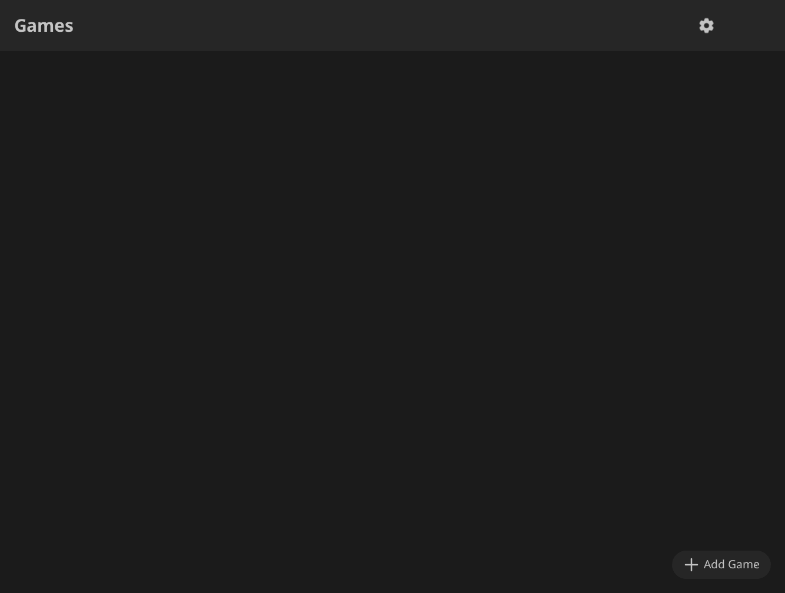
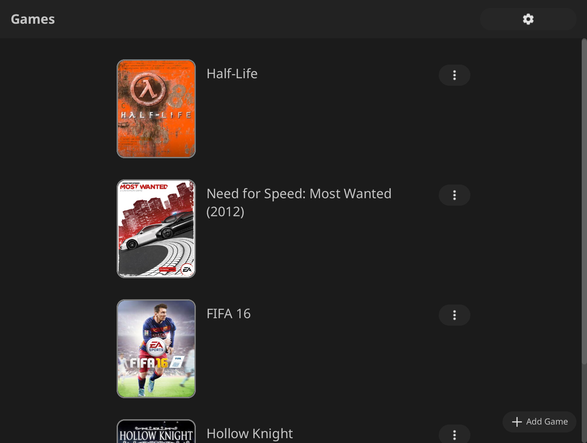
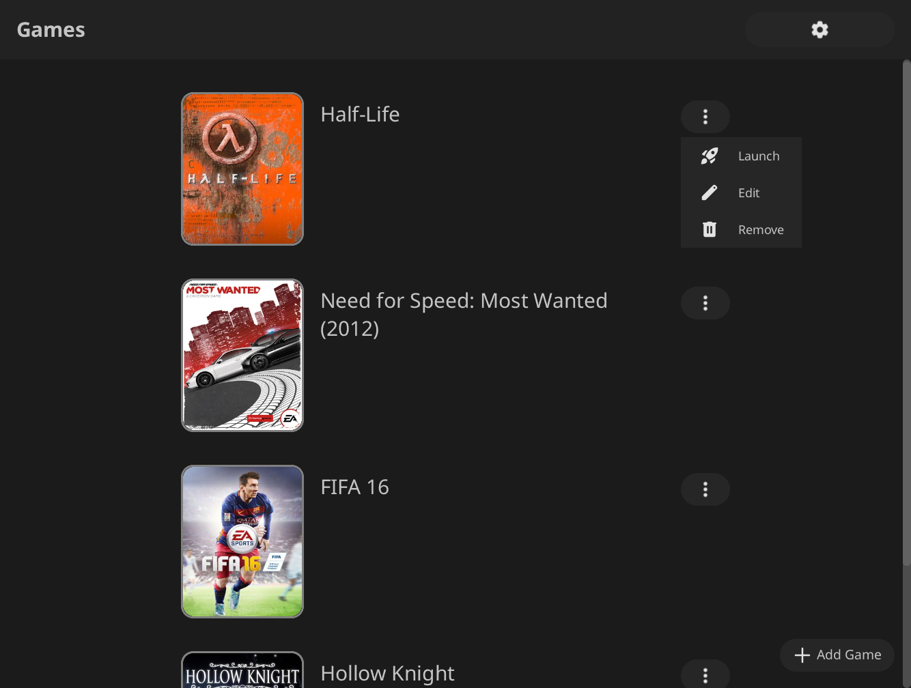
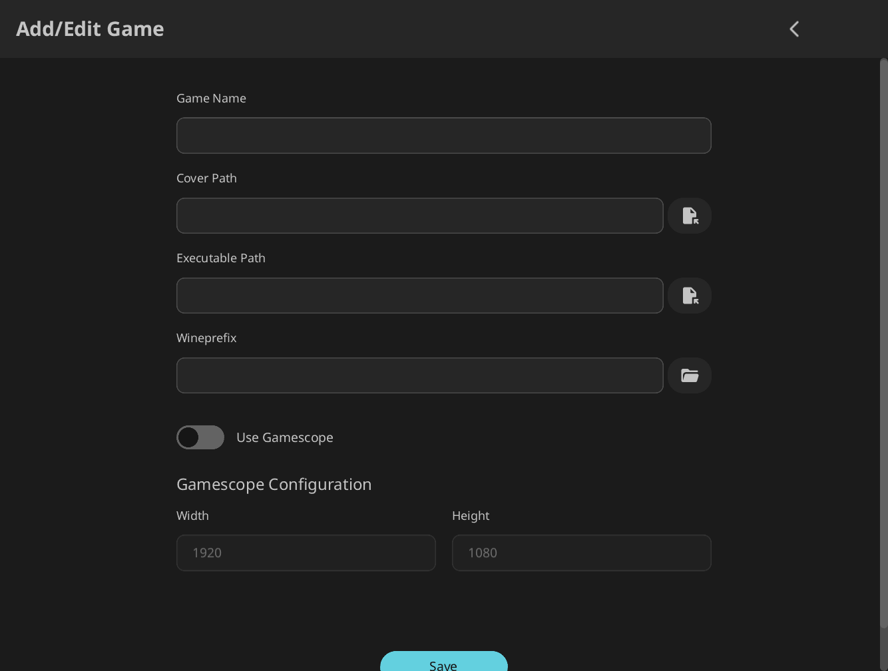
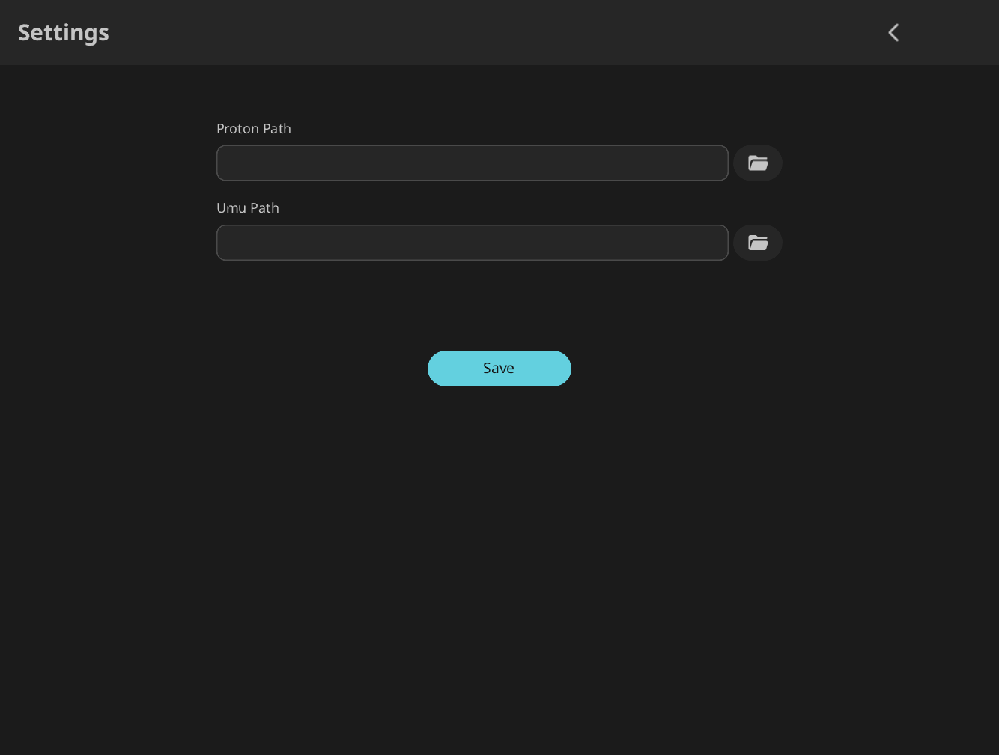

# Quarkpad

## Overview

Quarkpad is a simple, open-source game launcher for Linux, designed to manage and launch games using [https://github.com/GloriousEggroll/proton-ge-custom](Proton-GE). It uses [https://github.com/Open-Wine-Components/umu-launcher](Umu) to run proton without steam and [https://github.com/ValveSoftware/gamescope](Gamescope) for scaling and going fullscreen. The UI is made with the `slint` framework. You can organize the game library, add new games, configure basic settings, and launch them.

## Screenshots
<div style="display: flex; flex-wrap: wrap; justify-content: center;">
  
  
  
  
  
</div>

## Features

- **Game Management**: Easily add, edit, and remove games from your library.
- **Game Launching**: Launch games directly with configured Proton paths.
- **Cover Art Support**: Display cover images for your games for a richer visual experience.
- **Settings**: Configure global application settings, including the path to your Proton installation.
- **Persistent Data**: Game library and settings are automatically saved and loaded.

## Technologies Used

-   **Rust**: The primary programming language.
-   **Slint**: A declarative UI toolkit for building native user interfaces.
-   **TOML**: Used for serializing and deserializing application data (game list and settings).
-   **`dirs` crate**: For cross-platform discovery of user-specific directories to store application data.
-   **`rfd` (Rust File Dialogs)**: For native file/folder selection dialogues.

## Getting Started

You can install Hadron Launcher directly from crates.io:

```bash
cargo install quarkpad
```

After installation, you can run the application from your terminal:

```bash
quarkpad
```

### Prerequisites

- Rust and Cargo (latest stable version recommended)
- [https://github.com/GloriousEggroll/proton-ge-custom](Proton-GE)
- [https://github.com/Open-Wine-Components/umu-launcher](Umu)
- [https://github.com/ValveSoftware/gamescope](Gamescope)

### Building

Navigate to the project's root directory and use Cargo to build the application:

```bash
cargo build --release
```

The `--release` flag will produce an optimized executable.

### Running

After building, you can run the application directly:

```bash
cargo run
```

Or, if you built with `--release`:

```bash
./target/release/quarkpad
```

## Configuration

Quarkpad stores its game library and settings in a file named `data.toml`. This file is located in your system's local data directory, typically at:

`~/.local/share/quarkpad/data.toml`

You can manually inspect or edit this file, though it's recommended to use the application's interface for managing games and settings.

## License

This project is licensed under the terms available in the `LICENSE` file.
